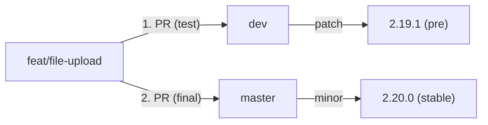

# 📦 Releases and Branching

This document explains how `@datawizio/rc` is versioned and published, and how we name
branches. Releases are fully automated — do not bump the version in `package.json` by hand.

## Branches

We keep two long-lived branches:

| Branch   | Role                      | Version bump | GitHub Release |
| -------- | ------------------------- | ------------ | -------------- |
| `dev`    | Integration / pre-release | **patch**    | Prerelease     |
| `master` | Stable, production-ready  | **minor**    | Stable         |

Everything else is a short-lived working branch. Open it into `dev` first, then — after
the prerelease looks good — open the **same branch** into `master`. Do not promote by
merging `dev` into `master`.



## How a release is triggered

The [Release](../.github/workflows/release.yml) workflow runs on every push to `dev` or
`master` (and can also be started manually). It:

1. Builds the library
2. Bumps the version (`npm version patch` on `dev`, `npm version minor` on `master`)
3. Commits `package.json` as `Bump to version X.Y.Z` and tags `vX.Y.Z`
4. Publishes `@datawizio/rc` to [GitHub Packages](https://npm.pkg.github.com)
5. Creates a GitHub Release with a changelog generated from commit subjects
6. After a **master** release, merges `master` back into `dev` so the two stay in sync
   (`[skip ci]` so that merge does not trigger another release)

Consumers install a specific version with:

```bash
yarn add @datawizio/rc@2.20.0
```

### What goes to `dev` vs `master`

- Open everyday work against **`dev`** first. Each merge publishes a new **patch
  prerelease** (for example `2.19.0` → `2.19.1`). Install that build in apps and verify
  the change.
- After it looks good, open a second PR from the **same working branch** into
  **`master`**. That merge publishes a **stable minor** (for example `2.19.1` → `2.20.0`).
  Do not open `dev` → `master` — that would ship every other unreleased change on `dev`.
- Urgent production-only fixes can go to **`master`** directly. That still bumps
  **minor**, and `dev` is synced afterwards.

Do not push commits straight to `dev` or `master` unless you intend to publish.

## Conventional branch names

Working branches follow [Conventional Branch](https://conventional-branch.github.io/):

```
<type>/<short-description>
```

- **`type`** — what kind of change this is (see the table below)
- **`short-description`** — kebab-case, lowercase, no spaces; a few words that describe
  the change

| Type       | Use for                                 | Example                       |
| ---------- | --------------------------------------- | ----------------------------- |
| `feat`     | New feature or public API               | `feat/file-upload-preview`    |
| `fix`      | Bug fix                                 | `fix/table-empty-state`       |
| `hotfix`   | Urgent fix aimed at `master`            | `hotfix/broken-publish`       |
| `refactor` | Internal change with no behavior change | `refactor/table-column-types` |
| `chore`    | Tooling, deps, cleanup                  | `chore/upgrade-antd`          |
| `docs`     | Documentation only                      | `docs/release-process`        |
| `test`     | Tests only                              | `test/datepicker-edge-cases`  |
| `ci`       | CI / GitHub Actions                     | `ci/release-changelog`        |
| `perf`     | Performance improvement                 | `perf/virtualize-select-list` |

✅ **Do**:

```
feat/attached-file-preview
fix/upload-dragger-hover
chore/upgrade-antd
docs/code-conventions
```

❌ **Don't**:

```
feature/Add File Upload
fix_table
maksym-wip
dev-fixes
```

Branch off the branch you will land in first:

- Regular work → branch from `dev`, PR into `dev`, then PR the same branch into `master`
- Hotfix for production → branch from `master`, PR into `master`

Delete the working branch after the PR is merged.

## Commit messages

The GitHub Release changelog is built from **commit subjects** between tags (merge commits
and `Bump to version …` commits are skipped). Write a short, specific subject in the
imperative mood — that sentence is what consumers will read.

✅ **Do**: `Fix upload dragger hover styles`

❌ **Don't**: `wip`, `fixes`, `update`

## Pull requests

PRs into `dev` or `master` run [Code Quality Checks](../.github/workflows/code-checks.yml)
(`yarn ci`: typecheck, lint, format, build). Keep one concern per PR so the changelog
stays readable after merge.

## Installing a just-published version

After the workflow finishes, the new version is on GitHub Packages. Point the consuming
app at that version (see the [README](../README.md) for `.npmrc` setup):

```bash
yarn add @datawizio/rc@<version>
```

Prereleases from `dev` are marked as prerelease on GitHub; stable versions from `master`
are not.
